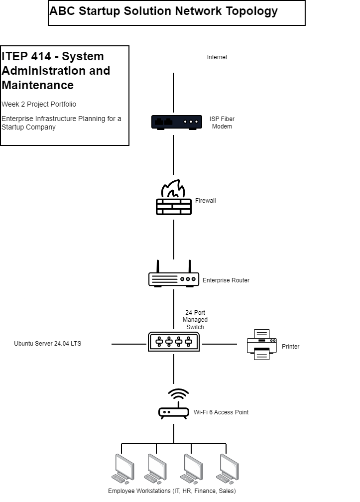

# ABC Startup Solutions - Enterprise Infrastructure Plan

> **Course Project:** System Administration  
> **Company:** ABC Startup Solutions  
> **Business Type:** Software Development & Cloud Applications

---

# Project Overview

This project presents a complete enterprise infrastructure plan for **ABC Startup Solutions**, a 20-employee software development company. It includes the company's hardware and software inventory, network infrastructure, system administration roles, security recommendations, backup strategy, and future expansion plan. The goal is to design a secure, reliable, and scalable IT environment that supports daily business operations.

---

# Learning Objectives

- Design an enterprise IT infrastructure for a small business.
- Select appropriate hardware and software for different departments.
- Create a secure and scalable network architecture.
- Understand the roles of Helpdesk, Network, Linux, and Cloud Administrators.
- Apply best practices in backup, cybersecurity, and system administration.

---

# Company Scenario

**ABC Startup Solutions** is a software development and cloud applications company with **20 employees** divided into four departments:

| Department | Employees |
|------------|----------:|
| IT | 5 |
| Finance | 5 |
| Sales & Marketing | 6 |
| HR & Operations | 4 |

The company requires secure networking, centralized file storage, VPN access for remote employees, cloud collaboration, and reliable backup systems.

---

# Hardware Inventory Summary

| Hardware | Qty | Purpose |
|----------|----:|---------|
| High-Performance Desktop | 9 | IT & Finance workstations |
| Business Laptop | 11 | Sales, HR & Finance Lead |
| 27" Monitors | 25 | Dual-display productivity |
| 2U Rackmount Server | 1 | AD, DNS, DHCP & file services |
| 24-Port Managed PoE Switch | 2 | Network connectivity |
| Enterprise VPN Router | 1 | Internet & VPN access |
| Wi-Fi 6 Access Point | 2 | Wireless coverage |
| 4-Bay NAS | 1 | Shared storage & backups |
| Encrypted Backup Drive | 3 | Offline backup |
| Smart UPS | 2 | Power protection |

**Total users supported:** **20 employees**

---

# Software Inventory Summary

| Software | Purpose |
|----------|---------|
| Windows 11 Pro | Employee operating system |
| Ubuntu Server 24.04 LTS | Enterprise server OS |
| Microsoft 365 | Productivity & collaboration |
| Visual Studio Code | Software development |
| Git & GitHub Desktop | Version control |
| VirtualBox | Virtual machine testing |
| Google Chrome Enterprise | Secure web access |
| Microsoft Defender | Endpoint security |
| AnyDesk | Remote IT support |
| 7-Zip | File compression & encryption |

---

## Embedded Network Diagram

*Figure 1. Enterprise Network Infrastructure of ABC Startup Solutions.*

**Network Features**

- Gigabit fiber internet
- VPN remote access
- VLAN-ready managed switches
- Corporate and Guest Wi-Fi
- Centralized server and NAS storage

---

# Technologies Used

### Hardware

- Enterprise Rackmount Server
- Managed Gigabit PoE Switches
- Wi-Fi 6 Access Points
- NAS Storage
- Smart UPS

### Software

- Windows 11 Pro
- Ubuntu Server 24.04 LTS
- Microsoft 365
- Microsoft Defender
- Git & GitHub
- AnyDesk

### Networking

- VPN
- DNS
- DHCP
- Active Directory
- VLAN
- Gigabit Ethernet

---

# Challenges Encountered

During this project, the biggest challenge was selecting hardware that balanced **performance, cost, and scalability**. Designing the network architecture also required understanding how routers, firewalls, managed switches, access points, and servers communicate within one enterprise network. Planning backup and security strategies helped demonstrate the importance of business continuity and data protection.

---

# Reflection

This project improved my understanding of enterprise system administration by combining networking, server management, security, and documentation into one complete infrastructure plan. I learned how different IT roles collaborate to maintain reliable business operations and why proper planning is essential before deployment. The experience strengthened my technical and analytical skills and prepared me for real-world System Administrator responsibilities.

---

# References

1. ABC Startup Solutions. *Enterprise Infrastructure Plan*. 
2. Canonical Ltd. *Ubuntu Server 24.04 LTS Documentation*. https://ubuntu.com/server/docs
3. Microsoft Learn. *Windows Security Documentation*. https://learn.microsoft.com/windows/security
4. Microsoft Learn. *Microsoft Defender for Endpoint Documentation*. https://learn.microsoft.com/defender-endpoint

---
**Author:** Shareef P. Tohmi  
**Course:** System Administration